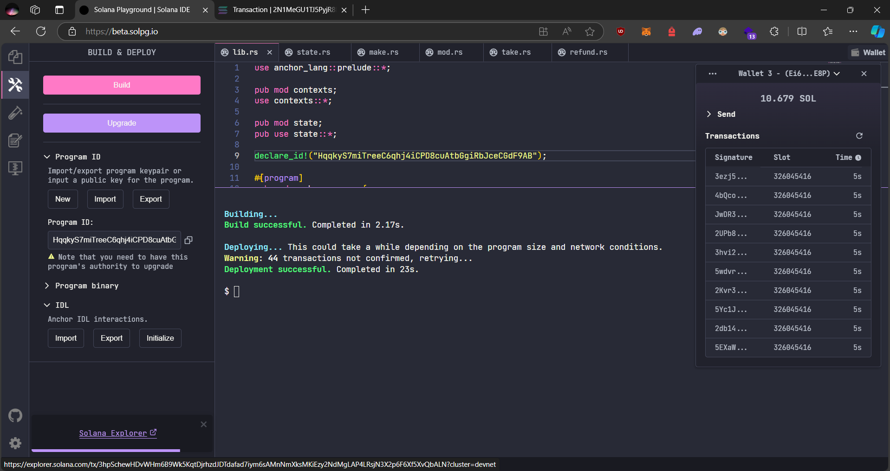

# SolRaise

**SolRaise** is a decentralized crowdfunding platform built on the Solana blockchain, designed to democratize fundraising and make it more efficient, transparent, and accessible to a global audience.

## Project Links

- **Main Project**: [Eshan-Sharma/SolRaise](https://github.com/Eshan-Sharma/SolRaise)
- **Main Project Live Link**: [https://sol-raise.vercel.app/](https://sol-raise.vercel.app/)
- **Mobile Project**: [Eshan-Sharma/SolRaise-Mobile](https://github.com/Eshan-Sharma/SolRaise-Mobile)


## Tech Stack

### Web Application (SolRaise)
- **Frontend Framework:** [Next.js](https://nextjs.org/) – A React-based framework for server-side rendering and static site generation.
- **Database ORM:** [Prisma](https://www.prisma.io/) – An intuitive ORM for managing database schemas and migrations, providing type-safe queries.
- **Database:** [PostgreSQL](https://www.postgresql.org/) – A powerful, open-source relational database used to store and manage application data.
- **CSS Framework:** [Tailwind CSS](https://tailwindcss.com/) – A utility-first CSS framework for designing a highly customizable UI.
- **UI Components:** [ShadCN UI](https://shadcn.dev/) – A modern UI library built on Radix Primitives and Tailwind CSS.
- **Blockchain:** [Solana](https://solana.com/) – A high-performance blockchain for fast, low-cost decentralized applications.
- **Smart Contracts Framework:** [Anchor](https://project-serum.github.io/anchor/) – A framework for building and deploying Solana smart contracts using Rust.
- **Language for Smart Contracts:** [Rust](https://www.rust-lang.org/) – A memory-efficient language, ideal for building reliable and high-performance Solana smart contracts.

### Mobile Application (SolRaise)
- **Framework:** [Expo](https://expo.dev/) – A powerful React Native framework for building cross-platform mobile applications.
- **Styling:** [NativeWind](https://www.nativewind.dev/) – Tailwind CSS for React Native, providing utility-based styling for mobile apps.
- **Database ORM:** [Prisma](https://www.prisma.io/) – Provides a unified data management layer for mobile.
- **Database:** [PostgreSQL](https://www.postgresql.org/) – Same as the web, PostgreSQL powers the mobile backend for data persistence and management.
- **Blockchain Integration:** [Solana React Native SDK](https://github.com/solana-labs/wallet-adapter) – A set of tools for integrating Solana into mobile apps with wallet and blockchain support.
- **Blockchain:** [Solana](https://solana.com/) – Fast and efficient blockchain used for decentralized applications.
- **Language for Smart Contracts:** [Rust](https://www.rust-lang.org/) – For building Solana programs.


## Solana Escrow Contract Information
- **Wallet used for deployment**: Ei6ERbXYRcDGnrrTJv7zRtMdyP14intfof9C7mLPjE8P

### Updated Deployment
- **Escrow Program ID**: HqqkyS7miTreeC6qhj4iCPD8cuAtbGgiRbJceCGdF9AB
- **Anchor IDL**: [IDL.json](solana-escrow/idl.json)
- 


### Initial Deployment
- **Escrow Account on Solana**: [Solana Explorer](https://explorer.solana.com/tx/3hpSchewHDvWHm6B9Wk5KqtDjrhzdJDTdafad7iym6sAMnNmXksMKiEzy2NdMgLAP4LRsjN3X2p6F6Xf5XvQbALN?cluster=devnet)
- **Escrow Program ID**: HqqkyS7miTreeC6qhj4iCPD8cuAtbGgiRbJceCGdF9AB
- **Anchor IDL**: [IDL.json](solana-escrow/idl.json)
- 

## PostgresSql table

This project uses **PostgreSQL** with **Prisma ORM** to manage a crowdfunding system, consisting of `Campaign` and `Donation` models.


### Table Breakdown

**Campaign Table**
- id: Unique identifier for the campaign (String).
- title: Campaign title (String).
- description: Description of the campaign (String).
- creatorWallet: The creator's wallet address (String).
- fundsGoal: The funding goal for the campaign (Float).
- duration: Duration of the campaign (Int).
- status: Current status of the campaign. Uses the CampaignStatus enum, which defaults to ACTIVE.
- createdAt: Timestamp when the campaign was created, defaults to the current time.
- updatedAt: Timestamp when the campaign was last updated, auto-updates on modification.
- donations: List of related donations.

**Donation Table**
- id: Unique identifier for each donation (String).
- campaignId: Foreign key referencing the campaign (String).
- campaign: Relation to the Campaign model.
- donorWallet: The wallet address of the donor (String).
- amount: Donation amount (Float).
- createdAt: Timestamp when the donation was made, defaults to the current time.

**CampaignStatus Enum**
- ACTIVE: Campaign is currently accepting donations.
- SUCCESSFUL: Campaign reached its funding goal.
= FAILED: Campaign failed to reach its goal.
- CANCELED: Campaign was canceled.

---

## Project Details

### Problem Statement

Traditional crowdfunding platforms face issues with inefficiency, high fees, and limited accessibility. **SolRaise** aims to solve these problems by leveraging blockchain technology and innovative features.

### Solution

SolRaise addresses these challenges by:

- Leveraging the Solana blockchain for fast, low-cost transactions
- Developing a user-friendly interface for both web and mobile (iOS/Android)
- Implementing donor-recipient matching to foster connections
- Creating a donation matching system to amplify contributions
- Ensuring transparency and security through blockchain technology

Our platform makes fundraising more efficient, transparent, and accessible to a global audience, while incentivizing giving through innovative features like donation matching.

---

## Goals and Milestones

1. Deploy a fully functional MVP on Solana devnet
2. Develop and launch the web platform with core features
3. Release beta versions of mobile apps for iOS and Android
4. Achieve 100 registered test users on devnet
5. Successfully execute 10 test fundraising campaigns
6. Implement and test a smart contract for donation matching
7. Integrate with at least 3 popular Solana wallets
8. Conduct thorough testing and bug fixing on devnet
9. Gather user feedback and implement key improvements
10. Prepare a comprehensive plan for mainnet migration

---

## Key Performance Indicators (KPIs)

### Primary KPI: Number of Successful Test Transactions

- **Success Milestone**: 10-100 successful test transactions within three months of devnet deployment.

### Secondary KPIs:

- Number of registered test users
- Number of completed test campaigns
- Average response time for transactions
- User-reported bugs and their resolution rate

---

## Setup Instructions for Next.js Project

To set up the **SolRaise** Next.js project locally, follow these steps:

1. **Clone the repository**:

   ```bash
   git clone https://github.com/Eshan-Sharma/SolRaise.git
   cd SolRaise
   ```

2. **Install dependencies**:

   ```bash
   npm install
   ```

3. **Set up environment variables**:
   Create a `.env.local` file in the root directory and add the necessary environment variables (e.g., Solana RPC URL, API keys).

4. **Run the development server**:

   ```bash
   npm run dev
   ```

5. **Open your browser**:
   Navigate to `http://localhost:3000` to view the application.

---

## Architecture
Alice holds asset A, and Bob holds asset B. Both want to trade their assets, but neither is willing to send theirs first, fearing that the other might not follow through and escape with both assets. This creates a deadlock, where neither party is willing to take the risk of initiating the exchange.

The conventional solution to this dilemma is to involve a third party, C, whom both Alice and Bob trust. In this arrangement, Alice or Bob sends their asset to C first. C then waits until the other party sends their asset, and only after receiving both assets does C release them, completing the trade securely.

https://makeagif.com/gif/-f4v626

1. Alice deposits Token A into an escrow account controlled by an escrow program.
2. Bob deposits Token B into the escrow program after confirming Alice's deposit.
3. Once both deposits are made, the escrow program swaps the tokens:
  Alice receives Bob’s Token B.
  Bob receives Alice’s Token A.
4. If Bob fails to deposit Token B within a set time limit, Alice can cancel the trade and retrieve her Token A.
---

## Contributing

We welcome contributions to **SolRaise**! Please read our [CONTRIBUTING.md](CONTRIBUTING.md) file for guidelines on how to submit pull requests, report issues, and suggest improvements.

---

## License

This project is licensed under the MIT License.
